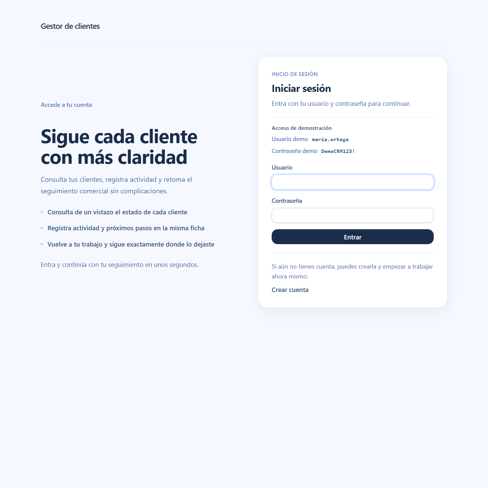
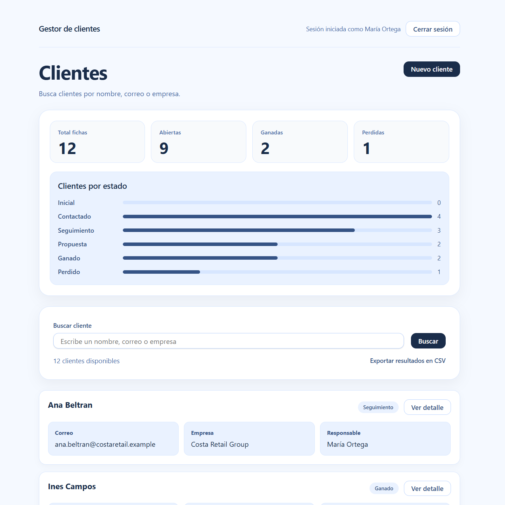
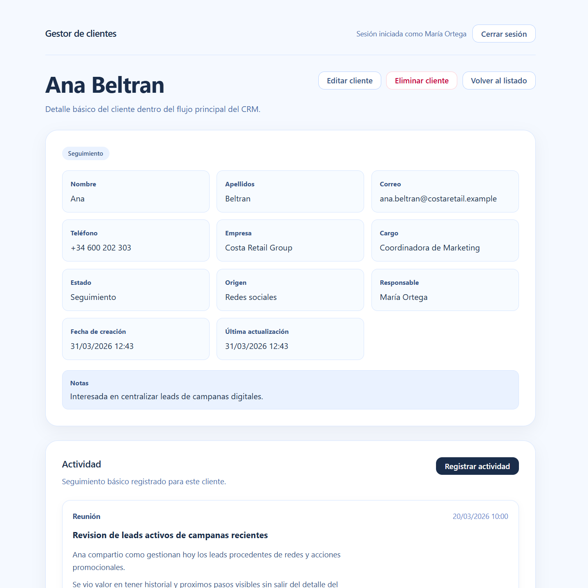
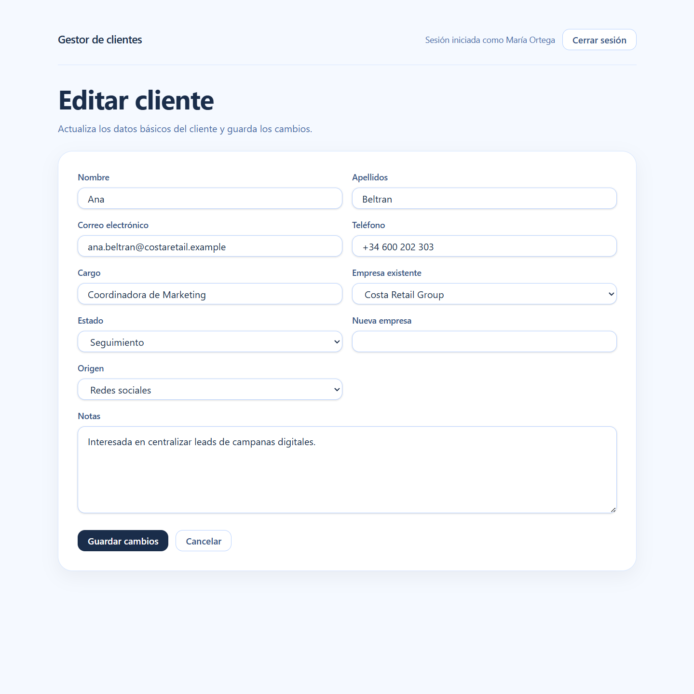

# CRM Básico con Django

Aplicación web de gestión comercial construida con Django para organizar clientes, registrar actividad y seguir un flujo comercial pequeño pero realista desde una interfaz clara y centrada en el trabajo diario.

En la interfaz, la aplicación se muestra como **Gestor de clientes**.

**Demo en vivo:** https://crm.franciscojbravo.com  
**Acceso demo:** `maria.ortega` / `DemoCRM123!`  
**Stack principal:** Python, Django, PostgreSQL, SQLite, HTML, CSS

## Resumen

CRM Básico permite a cada usuario gestionar sus propios clientes, asociarlos a una empresa cuando corresponde y registrar actividad comercial desde la propia ficha del cliente.

La aplicación está pensada como un proyecto Django server-rendered pequeño, serio y fácil de explicar. No busca cubrir un CRM grande ni complejo, sino resolver bien un núcleo funcional reconocible: clientes, actividad, búsqueda, estado comercial y una presentación suficientemente clara para demo, portfolio y revisión técnica.

Actualmente está desplegada públicamente, puede probarse con acceso demo y también puede ejecutarse en local con una base de datos de ejemplo generada mediante comando.

## Vista previa

Estas son algunas vistas reales de la aplicación en su estado actual.

  
  

  
  

## Qué permite hacer

### Gestión de acceso
- registro de cuenta
- login y logout
- acceso aislado por usuario
- acceso demo visible desde la pantalla de login

### Gestión comercial
- crear, editar y eliminar clientes
- asociar cada cliente a una empresa existente
- crear una nueva empresa directamente desde el formulario del cliente
- registrar, editar y eliminar actividad desde la ficha del cliente

### Seguimiento y consulta
- buscar clientes por nombre, correo o empresa
- seguir estados comerciales dentro de un pipeline simple
- consultar un mini dashboard de estados en el listado principal
- revisar la actividad y los próximos pasos desde la propia ficha del cliente

### Salida y demo
- exportar en CSV el listado filtrado de clientes
- cargar una demo reproducible con datos realistas mediante comando de siembra

## Qué incluye

- modelado relacional con clientes, empresas y actividad comercial
- vistas y formularios renderizados en servidor
- autenticación y autorización básica por usuario
- CRUD completo sobre clientes y actividad
- búsqueda integrada en el flujo principal
- validaciones a nivel de formulario y servidor
- tests funcionales y de comportamiento
- despliegue público en producción

## Stack utilizado

- **Python**
- **Django**
- **PostgreSQL** en producción
- **SQLite** en local
- **HTML renderizado en servidor**
- **CSS propio**
- **Tests con Django TestCase**

## Demo en vivo

La aplicación está disponible en:

**https://crm.franciscojbravo.com**

Puedes entrar con las credenciales demo:

- **Usuario:** `maria.ortega`
- **Contraseña:** `DemoCRM123!`

## Cómo ejecutarlo en local

### 1. Clonar el repositorio

    git clone https://github.com/fjbravo75/crm-basico-django.git
    cd crm-basico-django

### 2. Crear y activar entorno virtual

En Linux o WSL:

    python -m venv .venv
    source .venv/bin/activate

En Windows:

    python -m venv .venv
    .venv\Scripts\activate

### 3. Instalar dependencias

    pip install -r requirements.txt

### 4. Preparar variables de entorno

Copia el archivo de ejemplo:

    cp .env.example .env

Después, ajusta los valores si lo necesitas.

### 5. Aplicar migraciones

    python manage.py migrate

### 6. Cargar demo reproducible

    python manage.py seed_demo_crm

### 7. Levantar servidor local

    python manage.py runserver

La aplicación quedará disponible en:

`http://127.0.0.1:8000/acceso/login/`

## Variables de entorno

El proyecto incluye un archivo `.env.example` con la configuración base necesaria para arrancar.

Variables principales:

- `SECRET_KEY`
- `DEBUG`
- `ALLOWED_HOSTS`
- `CSRF_TRUSTED_ORIGINS`
- `DATABASE_URL`
- `SHOW_DEMO_ACCESS`
- `ALLOW_PUBLIC_REGISTRATION`

En local puede funcionar con SQLite sin configuración extra. En producción está preparado para usar PostgreSQL mediante `DATABASE_URL`.

## Demo reproducible

El proyecto incluye un comando de siembra para generar una base de datos de ejemplo de forma rápida y consistente:

    python manage.py seed_demo_crm

Este comando crea una demo con:

- **1 usuario demo**
- **3 empresas**
- **12 clientes**
- **29 actividades**

Credenciales demo por defecto:

- **Usuario:** `maria.ortega`
- **Contraseña:** `DemoCRM123!`

## Decisiones de implementación

- aplicación Django renderizada en servidor
- alcance contenido y centrado en el flujo principal del producto
- actividad resuelta dentro del detalle del cliente, sin abrir módulos laterales innecesarios
- demo reproducible mediante comando de siembra
- despliegue público con base de datos real en producción

## Estado actual del proyecto

El proyecto está desplegado y puede probarse directamente desde la demo pública.

A día de hoy incluye:

- acceso demo visible
- despliegue operativo en producción
- base local reproducible
- flujo principal de clientes y actividad cerrado
- estructura clara para revisión del código y prueba funcional